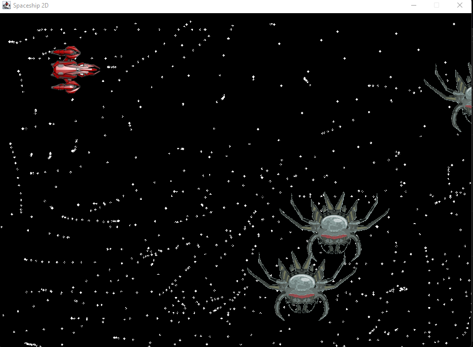

# Spaceship2D
<h1>Jogo básico desenvolvido em java</h1>

<h2>Objetivos</h2>
<ul>
  <li>Entender como funciona a biblioteca ImageIcon e Graphics do Java</li>
  <li>Estudar laços de Repetições com o objetivo de movimentar objetos em animações</li>
  <li>Estudar instanciação de objetos e suas funções de EventListener</li>
  <li>Entender o desenvolvimento básico de jogos 2D</li>
</ul>
